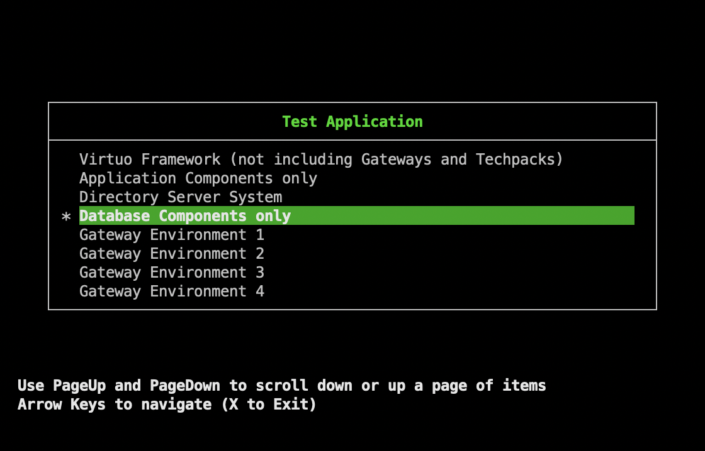

# tcmenu - Terminal Curses Menu

A simple, lightweight menu application using ncurses.



## Building

### Using autoconf (recommended)

```bash
./bootstrap.sh
./configure
make
```

### Manual build (if autoconf not available)

```bash
cc -std=c99 -Wall -Wextra -c tcmenu.c
cc -std=c99 -Wall -Wextra -c main.c
cc -o tcmenu tcmenu.o main.o -lmenu -lncurses
```

## Usage

```bash
./tcmenu --title "Menu Title" --entry "Option 1" "Option 2" "Option 3"
```

Or get help:

```bash
./tcmenu --help
```

### Options

- `-t, --title TEXT` - Set menu title
- `-e, --entry` - Start menu entries (all following args are entries)
- `-x, --exit` - Allow 'X' key to exit with code -3
- `-d, --default N` - Set default selection to N
- `-f, --fd N` - Output result to file descriptor N
- `-i, --interactive` - Force interactive mode
- `--theme THEME` - Set color theme: `dark`, `light`, or `nocolor` (auto-detected by default)
- `-h, --help` - Display help message

### Themes

The application supports three color themes:

- **dark** - Bright white text on black background with dark green accents
  - Background: black
  - Foreground: bright white
  - Title: dark green
  - Selection: white on dark green background
  - Default for most terminals

- **light** - Black text on bright white background with dark green accents
  - Background: bright white
  - Foreground: black
  - Title: dark green
  - Selection: bright white on dark green background
  - Default for xterm-color, xterm-256color, ansi

- **nocolor** - No colors, reverse video only
  - Default for non-color terminals

The theme is auto-detected based on the `TERM` environment variable, but can be overridden with `--theme`.

## Testing

```bash
./tm
```
